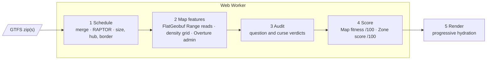

# Hide + Seek Map Rater

Point it at a city's public transit feed. It tells you whether that city works as a map for
[Jet Lag: The Game's *Hide and Seek*](https://www.jetlagthegame.com/) home game, how good a map it
is, and — if you're the one hiding — where to go.

It runs entirely in your browser, with no install and no build. The feed goes from the agency or
your disk straight into the tab, and is never uploaded anywhere.

---

## The problem this solves

*Hide and Seek* is played on a real transit system. One player rides to a hiding zone; the others
find them by asking questions from six categories — "is your nearest museum the same as mine?",
"are you within 3 miles of me?", "name the nearest library within a mile of us."

Whether the game is fun depends on the city.

| What breaks a map | Example | Where the report catches it |
|---|---|---|
| Too little network | Four bus routes give the seekers too little to search | A Zone supply |
| Missing features | No zoo, no coastline and no consulate quietly deletes a third of the seekers' toolkit | B Question health, §05 |
| Short service day | A last bus at six strands the hider | D Round viability |

Working that out by hand means reading the rulebook, reading the timetable and cross-referencing
every question against the map. This tool does it from the feed, the same way every time, for any
city that publishes one.

---

## Quick start

Nothing to install and no build step. Serve the repo root with any static file server and open it:

```bash
python3 -m http.server 8000              # then open http://localhost:8000/
node tools/smoke.mjs                     # headless: the pipeline, against 19 golden numbers
node tools/mdb-snapshot.mjs --check      # validate the committed feed catalogue, no network
```

The landing page is a world map of transit systems, one clustered marker per feed, drawn from a
tracked snapshot of the [Mobility Database](https://mobilitydatabase.org/) catalogue. Every control
sits in one panel floating on it: a column on the left on a desktop, a bottom sheet on a phone.

There are four ways in. A map pick and a feed of your own add up rather than replacing each other;
an example chip starts over with that city. Press **Analyse**: the download, the parse, the
travel-time model, the map-feature lookups and the scoring all happen in your browser.

| Way in | How | Use when | Note |
|---|---|---|---|
| Pick on the map | Search for a city or an operator, click a marker, or draw a shape and take every system it touches | The normal path | Two switches add regional and long-distance networks, and feeds nobody publishes any more; both are off by default because they overlap almost any shape you draw |
| Bring your own feed | Under *Or bring your own feed*, drop a `.zip` or paste a URL | The catalogue never loaded, the map library is blocked, or your agency never published to the Mobility Database | A URL needs CORS; see below |
| Start from an example | Press a chip: Chicago, New York and a dozen other metros | A one-click start | A hand-picked set of that city's public operators; campus shuttles and private coaches are left out on purpose. The chip replaces the selected feeds and the border; add to it, remove from it or press another |
| More than one system | Several map picks, or map picks plus your own feed, such as a metro plus its commuter rail, or two neighbouring operators a drawn shape crossed | One map from several operators | Up to ten feeds per run; each costs a download and a parse, and the eleventh is refused rather than merged |

> [!NOTE]
> Pasting a URL only works if the agency's server sends CORS headers, and plenty don't; the page
> will warn you. Then download the zip yourself and drop it in. A map pick fetches the catalogue's
> own mirror, which always sends them.

The map is optional: search, Add and Analyse all work before the map library loads, and if it never
loads.

**Where the game is played.** As soon as you pick a feed, a gold rectangle appears on the map: the
game border, fitted to what you picked.

| Control | Effect |
|---|---|
| Drag a corner, an edge or the middle | Resize or move the border |
| South, West, North and East fields in the panel | Type the four numbers |
| Shift+↑ / Shift+↓ in a field | Nudge that edge |
| Fit to feeds | Fit the border back to the feeds |
| Where they overlap | Seed it from where two systems overlap |
| Box around my shape | Box a shape you drew |
| Shrink 10 % / Grow 10 % | Shrink or grow it 10 % at a time |

| Border | What counts |
|---|---|
| Untouched | **Nothing changes**: the border is inferred from what the start stop can actually reach |
| Touched | The box becomes the game: stops outside it stop counting, and so do the zones, the size vote, the crossing time and the score |

**"Re-run with this border."** Some maps are two games in one: a metro plus its suburban operators
measures LARGE because the outer stops stretch the map across the whole region, though most people
mean to play the core.

- **Shown when:** a tighter box, everything the start stop can reach inside one hiding period,
  measures as a smaller, self-consistent game.
- **You see:** §01 gives the stop and departure counts, draws the suggested box beside the current
  one, and offers a button.
- **After pressing it:** everything re-runs inside that border, the feeds come back out of the
  browser's cache, and a chip at the top of the page says which run you are looking at and what the
  last one measured. The offer appears only when it would change the answer, so re-running inside
  it is the end, not the start of a loop.

**How long it takes.**

| Stage | Time |
|---|---|
| Schedule | Seconds |
| Map features | Around twenty seconds on a city-sized border |
| Second run | Much cheaper, from the browser's HTTP cache |

There is no switch to turn map features off, because a run without them loses this much:

| Questions | Curses | Score axes |
|---|---|---|
| Nearly half | Two thirds | Two of six |

If the map files genuinely cannot be read the run still finishes and says so; everything the feed
alone can answer is reported, and everything that needed map features is excluded from the
denominator rather than guessed at.

**Overrides.** The Advanced panel holds an override for every inference: game size · zone radius ·
hiding period · start stop · border shape · departure time · analysis date · excluded stops and
routes.

| Control | Effect |
|---|---|
| Excluded stops and routes | Narrow the whole report: excluded stops stop counting toward the zones, the size and the score |
| Border box | Read-only while the map shows a border, so the two can never disagree; edit it on the map |
| Ignore the cached transit feed | Re-downloads a feed the browser already cached, for when the agency publishes a new one |
| Use only the cached transit feed | Makes a cache miss an error, so a run either reproduces exactly what an earlier run saw or stops and says so |

---

## What comes out

| View | How to reach it | For | Answers |
|---|---|---|---|
| The report | The page itself | Everyone | Should we play here? |
| `#strategy` | Add `#strategy` to the URL | The hider | Where should I hide? |

### The report — should we play here?

A rating out of 100, the band it falls in, then eight sections of working that fill in section by
section as the pipeline runs.

| Rating | Band | Advice |
|---|---|---|
| 80+ | Excellent map | Play it as written; no house rules required. |
| 65+ | Strong map | A few house rules and it plays well. |
| 50+ | Playable with house rules | The house rules below are required, not optional. |
| 35+ | Marginal | Expect substantial modification: shrink the map or change the game size. |
| Below 35 | Not recommended as a transit game | Consider the rulebook's cars or on-foot variant. |
| No rating | Partly measurable | Fewer than 60 of the 100 points could be measured, so no number is shown. |

The five scored bands and their advice are `S3_BANDS` in [`rules/score.js`](rules/score.js).

| § | Section | What's in it |
|---|---|---|
| 01 | The map you're playing on | Live map of stops, zones and border; stat rail |
| 02 | What this means for your game | Strengths, what fights you, house rules to agree |
| 03 | Getting around | Crossing time and how often buses come |
| 04 | The verdict | Rating, band, and the game-size vote |
| 05 | The questions | **Every question in the deck**, each with a verdict |
| 06 | Every curse, checked | Which curses to physically remove |
| 07 | Where the points came from | Every point tied to metric, value, threshold |
| 08 | Where these numbers come from | Every query, source and interpretation |

The rating breaks into six sub-scores:

```
A  Zone supply           / 20     how many distinct places there are to hide
B  Question health       / 25     how much of the deck actually functions
C  Mobility & tempo      / 20     crossing time against the hiding period, and frequency
D  Round viability       / 15     whether a full round fits inside the service day
E  Schedule resilience   / 10     how far the weekend falls off the weekday
F  Structural fairness   / 10     whether one hub carries the whole network
```

| Game size | Small | Medium | Large |
|---|---|---|---|
| Questions in the deck | 58 | 71 | 80 |

Two counts get reported: fully functional, and works at all, which adds the weak questions that
barely narrow anything. Each day is rated separately (weekday, Saturday, Sunday), because a map can
be a materially worse game on a Sunday and you'd want to know before scheduling.

### `#strategy` — where should I hide?

> [!IMPORTANT]
> The hider's view is reached only by adding `#strategy` to the URL. It appears in no nav and no
> link, because the seekers will be looking at the report.

Every candidate zone is scored and ranked.

| Panel | What you get |
|---|---|
| Question simulator | Pick a question category, drop a seeker on the map, and watch zones split into yes, no and **edge**, where the ¼-mile circle straddles the boundary so the honest answer depends on where inside your zone you are standing. Modes: Radar · Thermometer · Matching · Measuring · Tentacles · No question, for plain exploring, which takes the slot of the catalogue's photo category since a photo has nothing for a map to partition |
| Zone dossier | Designated station · travel time from the start · the six axis scores · **what finds you**, the questions that most narrow the search onto you with the answer you'd be forced to give · candidate hiding spots with distances · amenities · service facts for the selected day · a full evidence table of every metric it earned |
| Every scored zone | Sortable by any axis. Zones unreachable inside the hiding period are held out of the ranking but still listed, with the reason and the travel time |
| Tactics | Derived from the rulebook and parameterised to this map, each citing its rule |

---

## How it works

Five stages. Everything downstream of the feed is deterministic.



### 1. Read the schedule

Parses GTFS, the standard format transit agencies publish. For each day with genuinely different
service: when the first and last buses run, how long the gaps between them really are, which routes
run, and which days have no service at all.

| Measure | Method | Why |
|---|---|---|
| Headway | **Midday median, not an average** | Midday is when you'll be playing |
| Travel time | **RAPTOR**, a real transit routing algorithm, over the actual timetable, transfer wait included | "35 minutes from the hub" means a genuine sequence of buses, not a straight-line guess |

From this it infers the game size (small/medium/large, using the rulebook's own definitions), the
hub station, and the map border.

**Several feeds become one.** When you pick more than one system, they are merged before anything
downstream sees them.

| Concern | Merge rule | Reader sees |
|---|---|---|
| Ids | Every id grows an `f0:` / `f1:` prefix | Two agencies that both number a route `1` cannot collide |
| Calendars | Each feed keeps its own | Each feed's own service days |
| Service window | The **intersection** of the feeds' windows | A warning when it is empty or shorter than a week |
| Time zones | A warning, never a refusal: every time in the pipeline is feed-local | A note that the clock alignment of a ride *between* the two systems is the one thing a mixed-zone merge gets wrong |
| Transfers | Built from stop proximity rather than `transfers.txt` | Two agencies whose stops sit forty metres apart are already connected |
| Provenance | Every feed that went in, with its own hash, window and operator | §08 |
| Fare | The **primary** operator's (the feed with the most trips), or the first feed with fares when it has none; there is no honest way to add two fare tables together | The house rule quotes one operator and says which |

### 2. Look up what's actually there

The rulebook's questions reference things GTFS knows nothing about — museums, zoos, golf courses,
hospitals, consulates, parks, mountains, coastlines. Those come from OpenStreetMap, read from
prebuilt **FlatGeobuf** files, one per feature category, served from a public bucket. Each file
carries a spatial index in its header, so the browser reads the index with HTTP Range requests and
fetches only the features inside the game border.

| | Prebuilt files |
|---|---|
| Gains | No rate limit · an immutable snapshot, so two people analysing the same city read identical data · a single origin that either answers or visibly doesn't |
| Cost | Freshness: every count is as of the planet snapshot the files were built from, and §08 says which |

> [!TIP]
> Each category is *defined* by an Overpass QL selector, printed verbatim in §08. A player who
> doubts a count can re-run the exact query at [overpass-turbo.eu](https://overpass-turbo.eu)
> against live OSM. The prebuilt files are a mechanical translation of those selectors.

| Data | Shape | Source |
|---|---|---|
| Features the questions name: museums, parks, coastlines and the rest | FlatGeobuf features, one file per category | OpenStreetMap |
| Categories that exist only to be counted: bridges, buildings, streets, footpaths, trees | A density grid, a per-cell tally at ~220 m resolution | OpenStreetMap |
| Administrative divisions | Division polygons | Overture Maps Foundation |

Map features are © OpenStreetMap contributors, ODbL; admin divisions are from Overture; the page
credits both.

**Distances go to the map icon, not the nearest edge**, as the rulebook says. For areas that point
is an area-weighted centroid with an interior fallback, never a bounding-box centre: a large park's
icon can be a mile from where you're standing inside it, and that choice changes the answer to a lot
of questions.

### 3. Audit the rules against the city

Every question in the deck gets a verdict. The status names and page labels are this tool's, not
the rulebook's.

| Status | Page label | Meaning |
|---|---|---|
| `functional` | works | Narrows the search |
| `weak` | barely helps | Can be asked and answered, but barely splits the map |
| `degenerate` | always the same answer | Exactly one on the map, so every zone answers the same; still pays the hider a card |
| `dead` | can't be answered here | None on the map, so it always returns null; still costs the seekers a question and pays the hider a card |
| `unknown` | not checked | Could not be evaluated on this run; excluded from the score rather than guessed at |

The dead list is usually longer than the list of missing features:
`one absent feature → dead in both Matching and Measuring` ·
`a map inside one state and country → both border questions dead` ·
`no rail mode → Train Platform dead`.

Curses get the same treatment. The rulebook says things like *"if there are no bridges on the game
map, this curse should be removed"*, so that becomes a real query against real data. Curses that
survive the geography check can still earn a warning, and a couple are flagged as player preference
rather than measurement.

### 4. Score it

**Map fitness** /100 · **Zone score** /100. Every point traces to a named metric (value · unit ·
threshold · basis), all printed on the page, and every row shows its basis:

`rulebook` From the rules · `feed` Measured · `interp` Our call, an interpretation

Metrics that can't be measured get **dropped and the denominator renormalised**, never guessed at.

| Axis | Max | Rewards |
|---|---|---|
| IR Information resistance | 30 | Sharing your answers with many other zones |
| R Reach | 15 | Getting here inside the hiding period, in few changes; pulls against X |
| S Service | 15 | Onward departures, short gaps, margin on the last ride out |
| E Endgame spots | 15 | Public places inside the circle where you can legally freeze |
| A Amenities | 15 | A usable bathroom, food and water, shelter |
| X Exposure | 10 | Being expensive for the seekers to reach; pulls against R |

Information resistance is the thing a human with a map can't do. For every live question, it
computes what every zone *would answer*, then how many other zones give the same answers. A zone
whose answer vector is shared with a crowd survives interrogation; a zone with a unique vector gets
named by one cheap question. The comfortable zone with the distinctive landmark next door is often a
*worse* hide than a boring one.

Zones that score well on both reach and exposure are what you're shopping for.

### 5. Render

One document, hydrated progressively. The pipeline runs in a Web Worker and streams staged results;
each section is swapped from skeleton to real markup the moment its data lands.

Stack: [Web Awesome](https://webawesome.com/) components · MapLibre + OpenFreeMap maps · no build
step, framework or bundler · light and dark themes · the selected game day follows you between the
two views.

---

## Determinism

The same feed and the same map files produce the same report, and a run is reproducible without
being offline.

| Source of drift | Pinned by |
|---|---|
| Wall clock | None reaches the output; every date comes from the feed's own calendar or the analysis-date override |
| Randomness | One fixed-seed permutation inside the minimum-enclosing-circle computation |
| Map and set order | Every dictionary and set is iterated through a sort |
| Feed bytes | Cached in the browser's IndexedDB, keyed by a hash of the exact request |
| Map files | Immutable and content-addressed |

If two people generate the report for the same city they must get the same report, or it isn't
evidence of anything.

---

## Repo layout

```
index.html           the page shell: landing stage, Advanced panel, eight skeleton sections
app.js               main-thread controller: owns every element, listener, and the worker protocol
worker.js            the pipeline orchestrator, off the main thread
lib/ gtfs/ osm/ rules/   worker-side pipeline (no DOM)
  gtfs/merge.js      merges several feeds into one, with per-feed id namespacing
render/              main-side renderers (Report → HTML strings)
  render/landing.js  the landing picker's markup, pure data → string
  render/picker.js   the landing map: MapLibre, clustering, the hand-rolled draw tool
lib/catalog.js       main-side reader for data/feeds.json: search, bbox intersection, feed URLs
data/feeds.json      the feed catalogue snapshot the landing map draws; one JSON object per
                     line so a regeneration reads as a diff
styles.css           the one stylesheet
CONTRACT.md          authoritative for every shape crossing a module boundary
tools/smoke.mjs      headless harness: runs the real pipeline, asserts 19 golden numbers,
                     then the merge assertions
tools/mdb-snapshot.mjs rebuilds data/feeds.json · --check validates offline · --counts measures stops and routes
tools/osm-world/     builds the prebuilt OpenStreetMap files the app reads
  build.py           planet.osm.pbf -> per-category FlatGeobuf -> R2 (uv script)
  categories.json    the build table: one entry per category, plus the density grid
  README.md          why FlatGeobuf, what a build costs, how sharding and CI work

README.md            this file
AGENTS.md            notes for AI coding agents: architecture, conventions, measurements
GUIDE.md             \
HIDING.md             >  the Hide+Seek rulebook — the authority on game rules
SEEKING.md           /
package.json         local Web Awesome Pro source, for reading only; nothing imports it
                     (the page loads the hosted kit pinned in index.html). Do not delete.
```

The design specs the code occasionally cites (`specs/*.md`, `scoring.md`) live outside the repo.

---

## Caveats

> [!WARNING]
> **Scheduled times are not real times.** Everything comes from the published timetable. Check live
> tracking on game day.

> [!WARNING]
> **The "within 10 ft of a routable path" test is not evaluated.** Checking it needs a buffer around
> every walkable way on the map, which the prebuilt files don't carry. Candidate hiding spots are
> still found and listed, but every one is marked Verify on site. Stand somewhere legal.

| Caveat | What it means | Check with |
|---|---|---|
| OpenStreetMap isn't Google Maps | The rulebook assumes players use a maps app, and its legitimacy test (5+ Google reviews) has no OSM equivalent; expect some category disagreements at the margins | The selector printed for each category in §08 |
| The map data is a snapshot, not live | The prebuilt files reflect OSM as of the planet dump they were built from | The date in §08, and the selectors next to each count run against live OSM |
| A map pick downloads the catalogue's mirror, not the agency's own file | MobilityData's copy of the latest zip it fetched can differ from the agency's file in hash and publication date, so a run from the map and one from the agency's URL can legitimately disagree | §08, which names the exact source of every feed |
| The feed catalogue is a snapshot, and its boxes are crude | Each system is placed by the bounding box the catalogue records: enough to drop a marker, *not* evidence of where that system runs today | `data/feeds.json`; see below |
| Nothing guards the map layer against a country-sized border | The OSM layer's cost scales with the border, and several systems or a very large shape can produce a border far bigger than anything this has been run on | Not guarded |
| Tested on few cities | The map layer on a handful of cities, small and large; the schedule side on a few more, including heavy-rail systems | Unproven beyond those |

<details>
<summary>How the feed catalogue is kept</summary>

- The markers come from `data/feeds.json`, curated from the Mobility Database's published CSV,
  refreshed monthly by `.github/workflows/feed-catalogue.yml` as a pull request and regenerable with
  `node tools/mdb-snapshot.mjs`.
- A box withdrawn upstream keeps the one the file already had and marks the row `k`.
- Systems spanning more than 250 km and feeds no longer updated are hidden behind opt-in switches,
  but can be added from search.
- Feeds that need an API key cannot be fetched by the page; it shows them and links the agency's own
  download.
- A system whose agency never published to the Mobility Database is not on the map: that is what
  bringing your own feed is for.

</details>

**Some of this is interpretation**, and the rulebook is genuinely ambiguous in places. Those spots
are labelled as interpretations on the page, but you and your group are the final authority. It's
your game.
